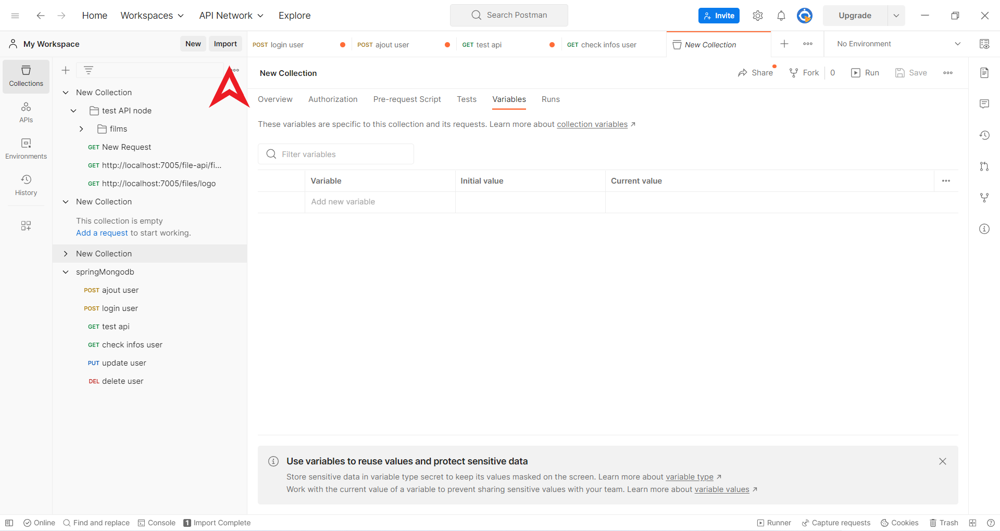

# tutorial Installation de du back-end :

## 1.Installer la base de donnée mongoDB:

- Installation de de la base de donnée mongo

[Installation de mongoDB ](https://www.mongodb.com/fr-fr)

## 2.Installer Compass pour MongoDB:

- Permet une utilisation plus simple de MangoDB.

[Installation de Compass pour la gestion de mongoDB ](https://www.mongodb.com/fr-fr/products/compass)

## 3.Installer mongosh pour MongoDB:

- Permet des la premiere utilsation d'ajouter facilement des Roles ,Utilisateurs,et des factures en console.

[Installation de mongosh ](https://www.mongodb.com/try/download/shell)

## 4.Ajout des premieres donées :

- Une fois Mongo ,compass et Mongosh installé,ouvre Mongosh
    - colle ensuite ses informations :

    - Cela nous permet de créer les roles pour les utilisateurs:

  ```js   db.roles.insertMany([
   { name: "ROLE_NEW_USER" },
   { name: "ROLE_CLIENT" },
    { name: "ROLE_PROVIDER" },
    { name: "ROLE_ADMIN" },
    { name: "ROLE_SUPER_ADMIN" },
    ])```

#### Nous diposerons donc de 5 roles :

<h4 style="text-decoration: underline;">NEW_USER :</h4>
<p>Nouvel utilisateur qui n'a aucun droit .</p>
<p>Il possede simplement l'acces a l'application,et peut remplir le formulaire d'insciption (Particulier ou Entreprise).</p>
<p>Il devra attendre la validation de l'admin pour obtenir un acces plus elevé</p>

<h4 style="text-decoration: underline;">CLIENT:</h4>
<p>Il a le role client et peut consulter ses factures qui lui sont attribuées.</p>
<p>Il peut valider ou refuser une facture.</p>

<h4 style="text-decoration: underline;">PROVIDER :</h4>
<p>Il peut envoyer ses factures depuis l'application.</p>
<p>Il peut egalement sauvegarder ses factures au format brouillon,et supprimer ses factures</p>

<h4 style="text-decoration: underline;">ADMIN :</h4>
<p>IL gere les roles de l'application.</p>
Exemple : Suite a une incription d'un nouvel utilisateur,si l'utilsateur a rempli sont formulaire d'inscription et que le formulaire est valide,alors l'admin pourra donner un role plus important a l utilisateur (role  CLIENT ou Role PROVIDER).
<p>Il gere problemes sur les factures ou toutes les modifications liées au compte de l'utilisateur.</p>

<h4 style="text-decoration: underline;">SUPER ADMIN :</h4>

<p>Pour le moment c' est un role optionel .</p>
<p>Le SUPER ADMIN a touts les droits de gestion de l'application CREATION,EDITION ,SUPPRESSION sur touts les utilisateurs (NEW_USER,ClLIENT,PROVIDER,ADMIN)</p>
<p>Il peut gerer touts les roles.,il peut gerer tout les utilisateurs,il peut gerer touts les admins</p>


## 5.Ajout d'un utilisateur
<p>Pour cree notre premier utilisateur nous devrons utiliser <b>POSTMAN</b></p>

[Installation de postman](https://www.postman.com/)

Postman est un gestionnaire de requetes http il nous permettra de tester l'application.

<p>Pour créer notre nouvel utilisateur et pour avoir les droits minimum néssésaire nous devrons créer un utilisateur avec le role ADMIN</p>
<p>Pour se simplifier la vie voila une collection POSTMAN qui permet de créer éditer supprimer un utilisateur</p>

copie le lien de la collection POSTMAN
```json
https://api.postman.com/collections/20077981-7c1456ad-b344-4d63-a89e-57d1f69ebb1c?access_key=PMAT-01H00V41478XEQD8AEXF304Q9W
```

<p>Ouvre POSTMAN connecte toi toi puis va dans l'onglet collection puis import</p>


<p>Colle l 'url puis importer</p>

tu peut maintenant creer ton premier utilisateur